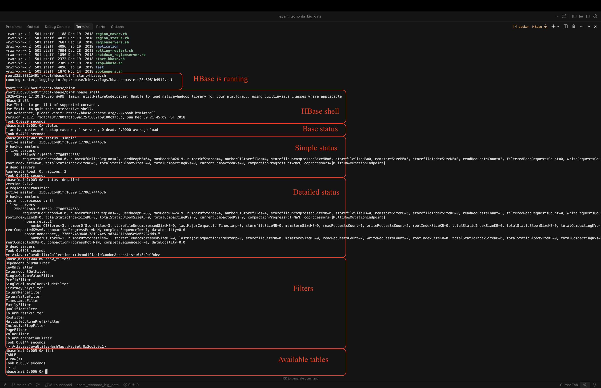
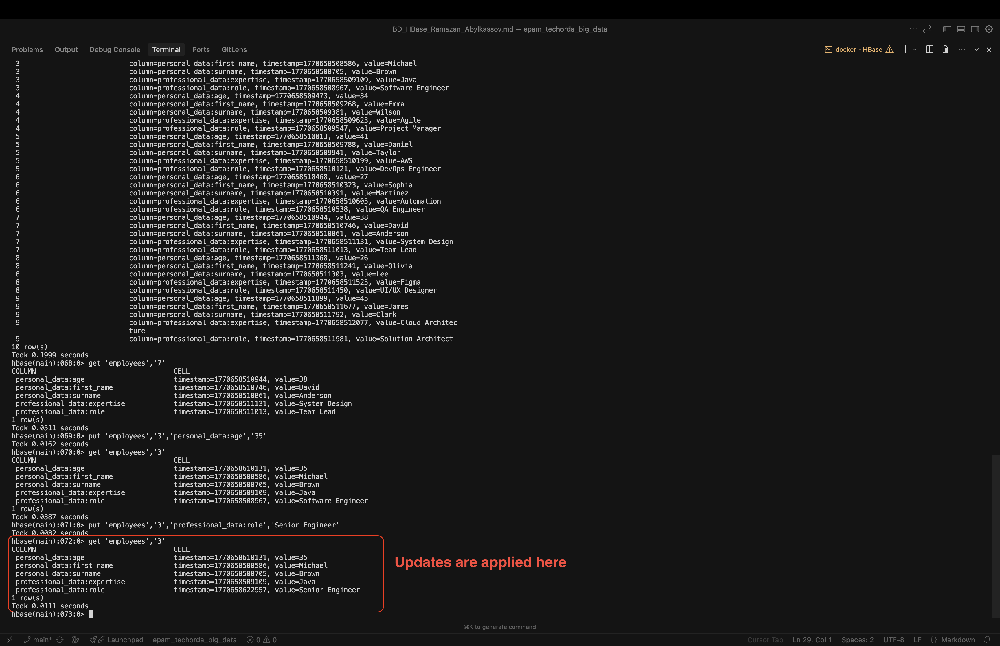
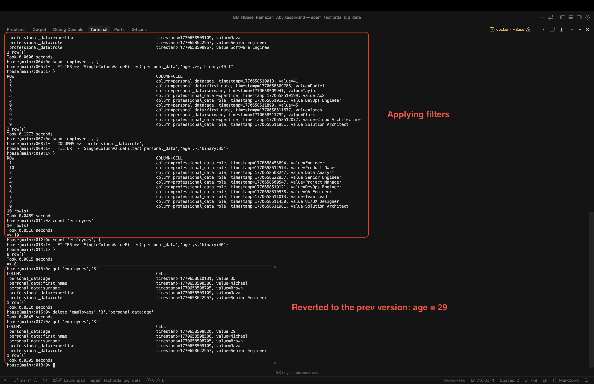
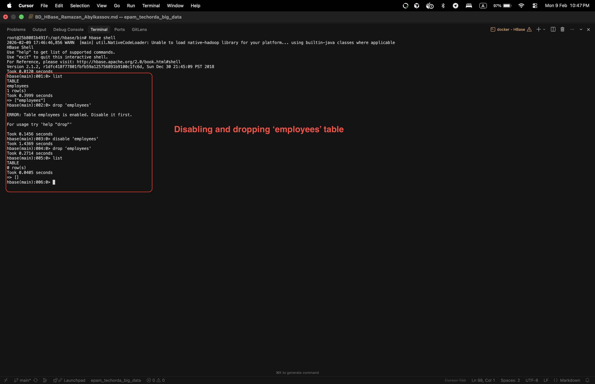

# HBase – Task Answers

> **Repository:** [GitHub – EPAM TechOrda Big Data](https://github.com/ramazanabylkassov/epam_techorda_big_data/blob/main/noSQL/HBase/BD_HBase_Ramazan_Abylkassov.md)

---

## Task 1 – View HBase Scripts

### Enter the Container and Explore Scripts

```bash
docker exec -it hbase /bin/bash
cd /opt/hbase/bin
ls
```

The `bin` directory contains ~25 HBase scripts (start, stop, shell, daemons).

### Enter HBase Shell

```bash
start-hbase.sh
hbase shell
```

### HBase Status

```bash
status
status 'simple'
status 'detailed'
```

Returns base, concise, and detailed cluster status respectively.

### List All Filters

```bash
show_filters
```

Displays all available HBase scan filters.

### List All Tables

```bash
list
```

Shows all tables in HBase.



---

## Task 2 – Table and Data Creation

### Step 1: Create `employees` Table

```bash
create 'employees',
  {NAME => 'personal_data', VERSIONS => 2},
  {NAME => 'professional_data', VERSIONS => 4}
```

### Step 2: List Tables

```bash
list
```

### Step 3: Insert Employee Data (IDs 1–10)

Example for employee ID = 1:

```bash
put 'employees','1','personal_data:first_name','John'
put 'employees','1','personal_data:surname','Smith'
put 'employees','1','personal_data:age','28'
put 'employees','1','professional_data:role','Engineer'
put 'employees','1','professional_data:expertise','Backend'
```

Repeat for employee IDs 2 through 10.

### Step 4: Scan All Employees

```bash
scan 'employees'
```

### Step 5: Get Employee with ID = 7

```bash
get 'employees','7'
```

### Step 6: Update Employee ID = 3

```bash
put 'employees','3','personal_data:age','35'
put 'employees','3','professional_data:role','Senior Engineer'
```

### Step 7: Verify Updates

```bash
get 'employees','3'
```

### Result

- `employees` table created with versioned column families
- 10 employee records inserted
- Data scanned and retrieved
- Employee data successfully updated and verified



---

## Task 3 – Query Data

### Query All Records

```bash
scan 'employees'
```

### Get Employee ID = 3 (Last 3 Versions)

```bash
get 'employees','3',{COLUMN=>'personal_data',VERSIONS=>3}
get 'employees','3',{COLUMN=>'professional_data',VERSIONS=>3}
```

### Employees with Age ≥ 40

```bash
scan 'employees', {
  FILTER => "SingleColumnValueFilter('personal_data','age',>=,'binary:40')"
}
```

### Get Role for Employees with Age > 35

```bash
scan 'employees', {
  COLUMNS => 'professional_data:role',
  FILTER => "SingleColumnValueFilter('personal_data','age',>,'binary:35')"
}
```

### Count All Employees

```bash
count 'employees'
```

### Count Employees with Age < 40

```bash
count 'employees', {
  FILTER => "SingleColumnValueFilter('personal_data','age',<,'binary:40')"
}
```

### Delete Latest Age for Employee ID = 3

```bash
delete 'employees','3','personal_data:age'
```

### Verify Age Reverted for Employee ID = 3

```bash
get 'employees','3'
```



---

## Task 4 – Delete Table

### Disable the Table

```bash
disable 'employees'
```

### Delete the Table

```bash
drop 'employees'
```

### Verify Deletion

```bash
list
```

The `employees` table should no longer appear in the list.


