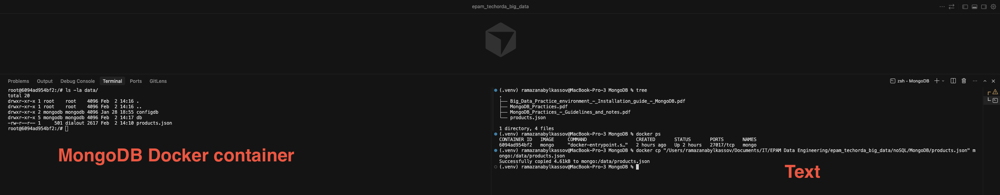
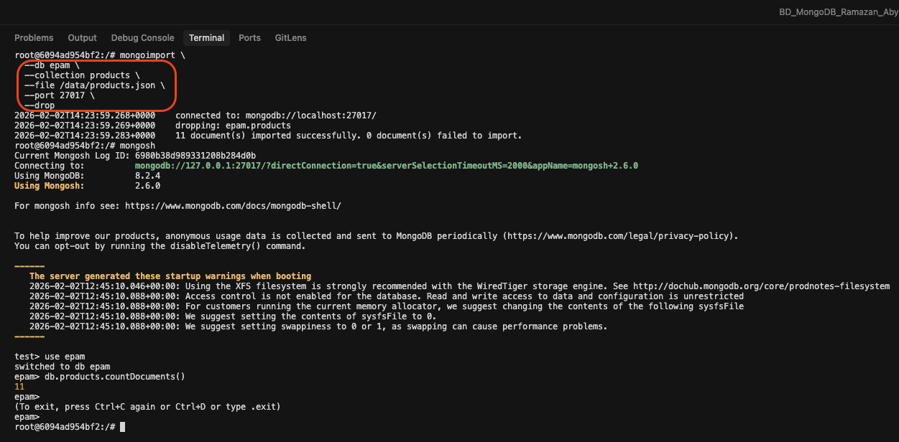
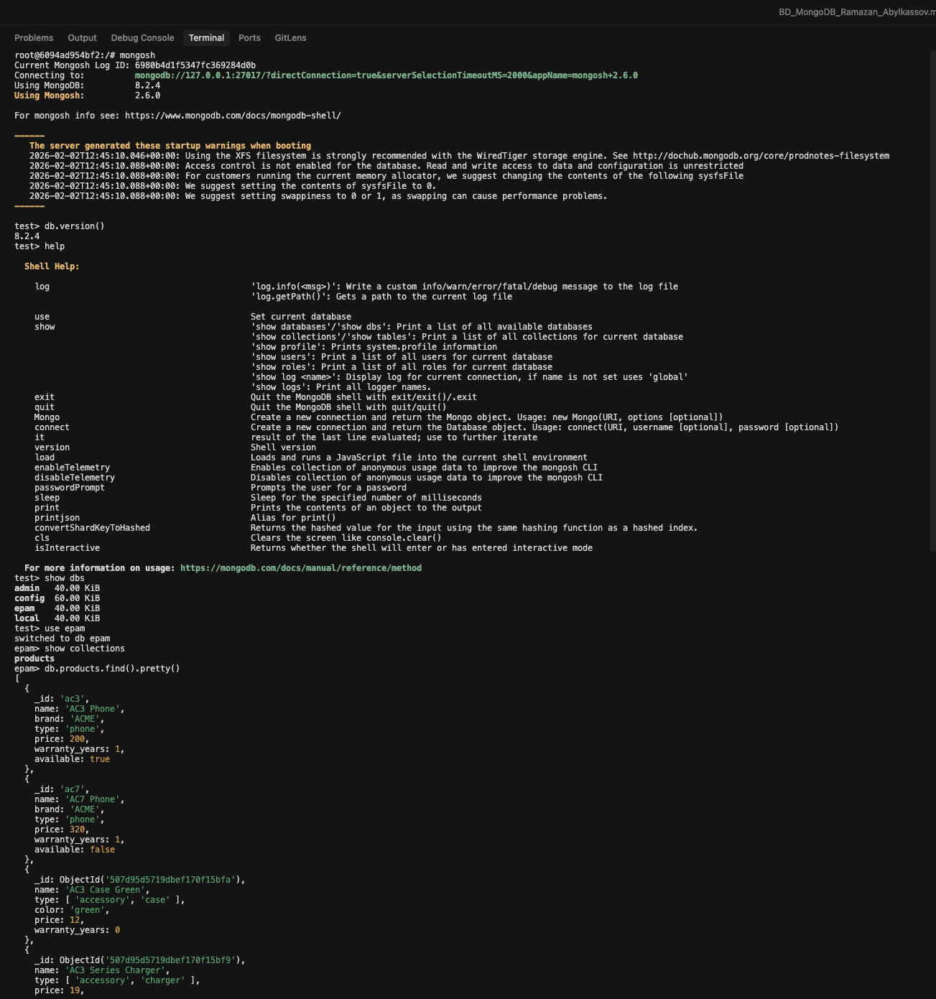
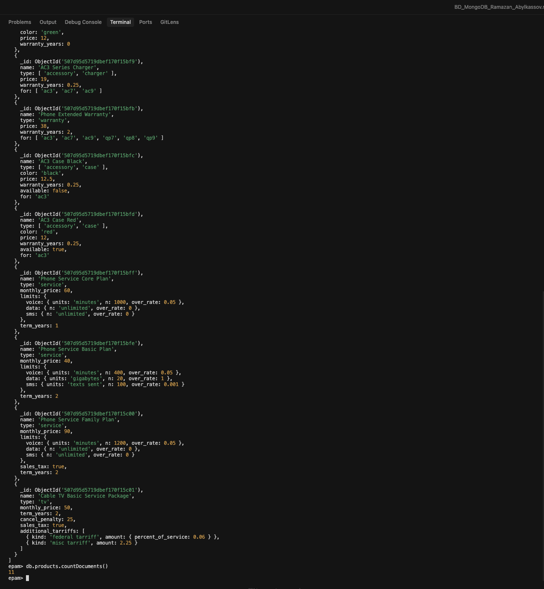
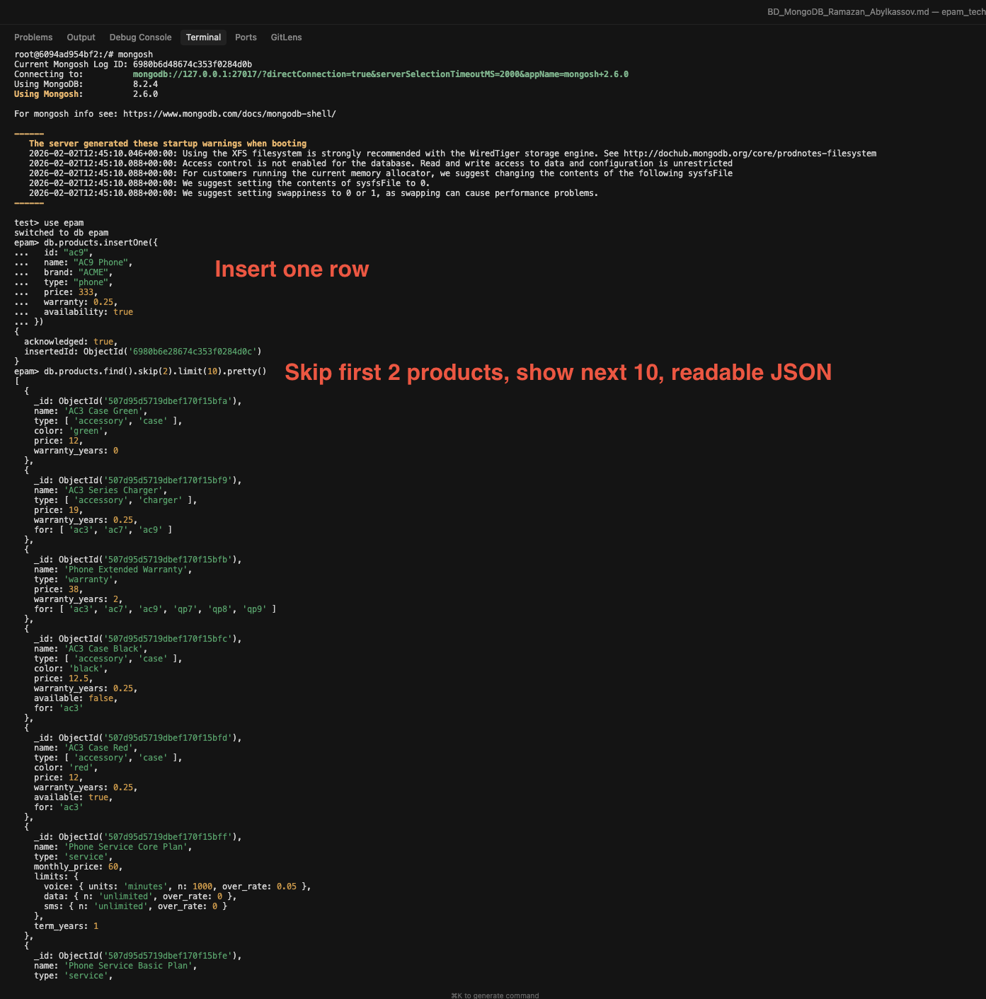
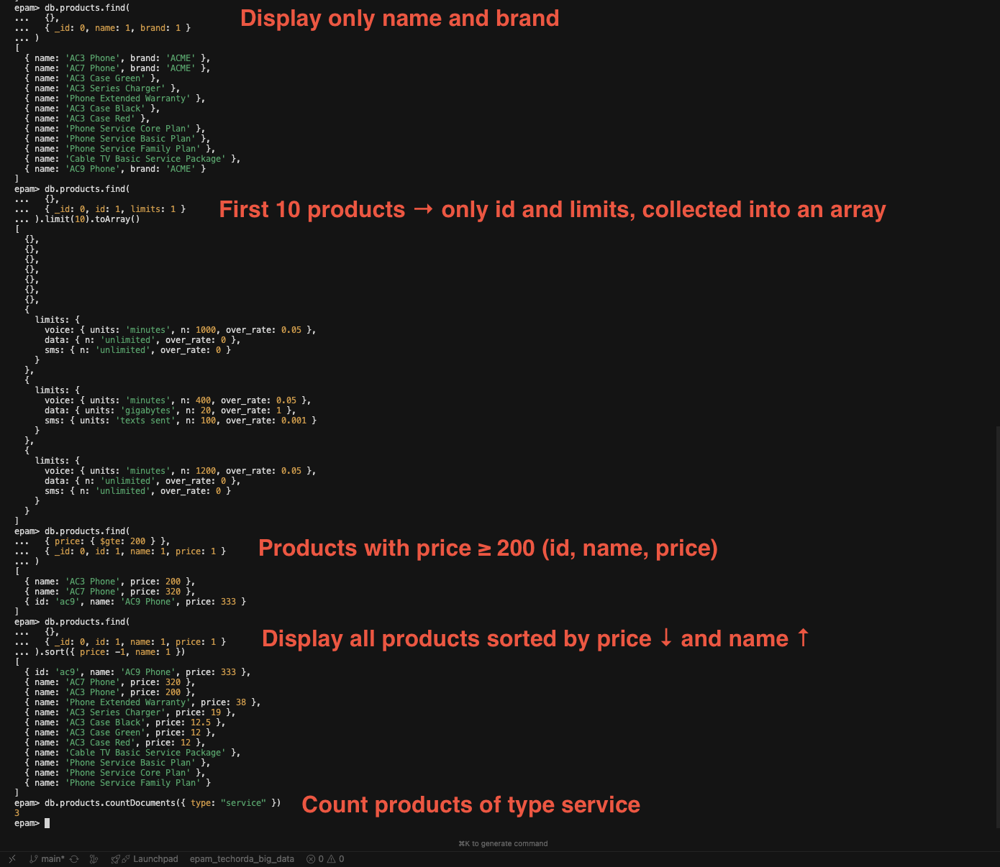
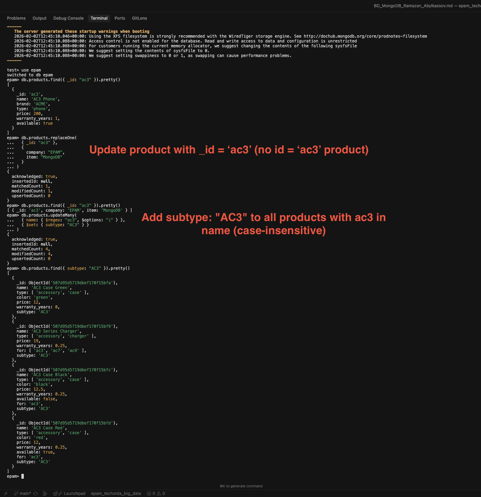
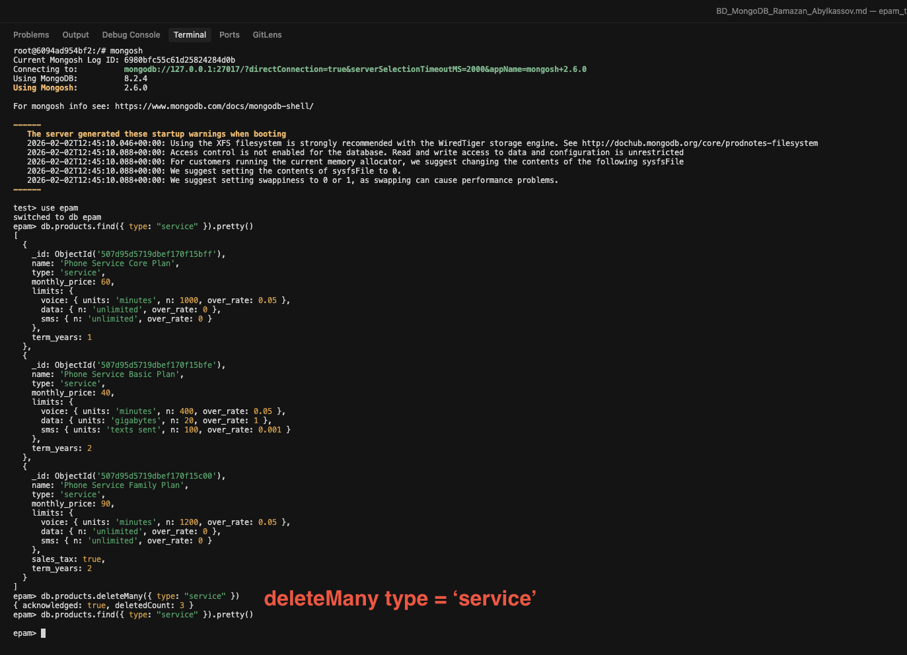
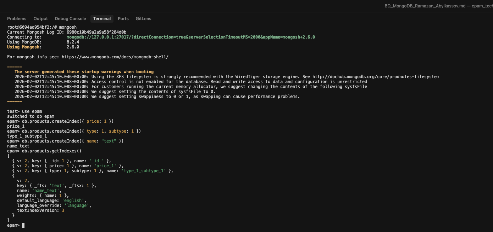
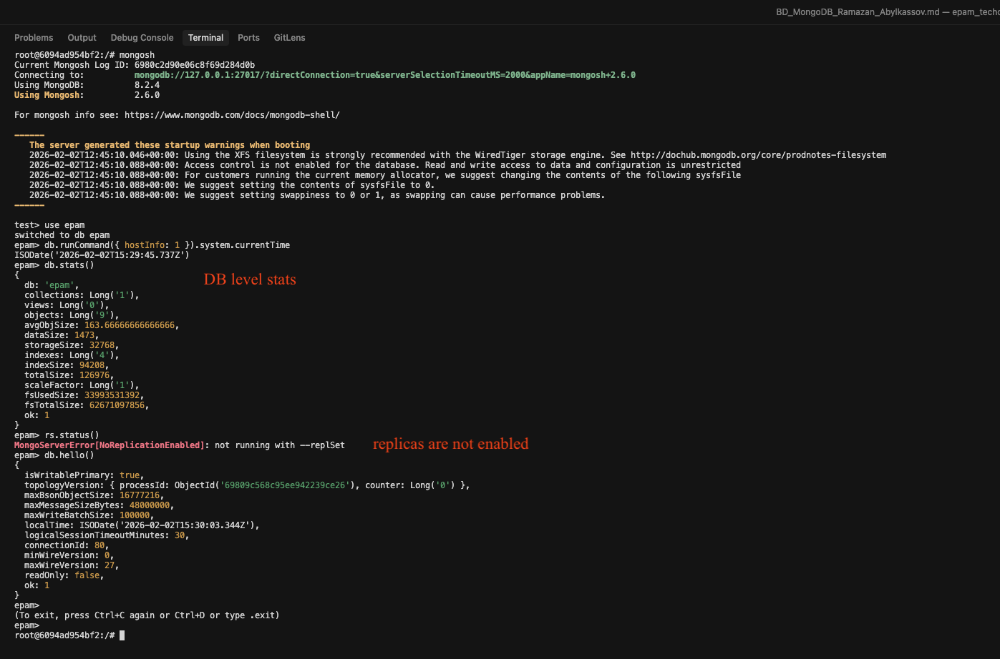

# Kafka Practice - Task Answers

> **Repository:** [GitHub - EPAM TechOrda Big Data](https://github.com/ramazanabylkassov/epam_techorda_big_data/blob/main/noSQL/MongoDB/BD_MongoDB_Ramazan_Abylkassov.md)

---

# Practical Task: MongoDB

---

## 1. General Details and Practice Preparation

The `products.json` file was downloaded to the local machine and stored in the project directory. To make the file available inside the MongoDB Docker container, the `docker cp` command was used.

First, the running MongoDB container was identified:

```bash
docker ps
```

The file was then copied from the local file system into the container. Because the local file path contains spaces, the full path was wrapped in quotation marks:

```bash
docker cp "/Users/ramazanabylkassov/Documents/IT/EPAM Data Engineering/epam_techorda_big_data/noSQL/MongoDB/products.json" mongo:/data/products.json
```

After copying the file, the container was accessed and the file location was verified:

```bash
docker exec -it mongo bash
ls /data
```

The output confirmed that the `products.json` file was successfully copied into the container at `/data/products.json`.



---

## 2. Import Products Data into MongoDB

After copying the `products.json` file into the Docker container, the data was imported into MongoDB using the `mongoimport` utility.

The MongoDB container was accessed using the following command:

```bash
docker exec -it mongo bash
```

To identify the required import options, the help command was executed:

```bash
mongoimport --help
```

The products data was imported into a database named `epam` and a collection named `products`. The default MongoDB port (27017) was explicitly specified, and the `--drop` option was used to remove the existing collection before loading new data:

```bash
mongoimport \
  --db epam \
  --collection products \
  --file /data/products.json \
  --port 27017 \
  --drop
```

After the import, the MongoDB shell was opened and the data load was verified:

```bash
mongosh
use epam
db.products.countDocuments()
```

The returned document count confirmed that the data was successfully imported into the MongoDB collection.



---

## 3. Verify the Loaded Data in MongoDB

To verify that the data was successfully loaded, the MongoDB shell was accessed from inside the Docker container:

```bash
mongosh
```

### MongoDB Connection Details

It was not necessary to specify the hostname or port number when connecting to MongoDB because the database is running locally inside the Docker container and uses the default MongoDB port (27017).

The MongoDB version was checked using the following command:

```js
db.version()
```

### Available MongoDB Options

The available MongoDB commands and options related to databases, collections, and query operations were reviewed using:

```js
help
```

### Existing Databases

All databases available in the MongoDB instance were listed using:

```js
show dbs
```

### Switching to the `epam` Database

```js
use epam
```

### Existing Collections in the `epam` Database

```js
show collections
```

### Listing All Documents in the `products` Collection

```js
db.products.find().pretty()
```

### Counting Documents in the `products` Collection

```js
db.products.countDocuments()
```

The returned results confirmed that the `products` collection exists in the `epam` database and contains the expected number of documents.




---

## 4. CRUD Operations in MongoDB Collections

This section demonstrates Create, Read, Update, and Delete (CRUD) operations performed on the `products` collection in the `epam` database.

### Create Operation

A new product document was inserted into the `products` collection with the required attributes:

```js
db.products.insertOne({
  id: "ac9",
  name: "AC9 Phone",
  brand: "ACME",
  type: "phone",
  price: 333,
  warranty: 0.25,
  availability: true
})
```

### Read Operations

**Query 1: Skip and Limit Results**

The first two products were skipped, and the next ten products were displayed in a readable JSON format:

```js
db.products.find().skip(2).limit(10).pretty()
```

**Query 2: Display Only Product Name and Brand**

```js
db.products.find(
  {},
  { _id: 0, name: 1, brand: 1 }
)
```

**Query 3: Display `id` and `limits` Fields for First 10 Products**

The results were collected into a single array:

```js
db.products.find(
  {},
  { _id: 0, id: 1, limits: 1 }
).limit(10).toArray()
```

> **Note:** Not all documents contained both `id` and `limits` fields. This is because MongoDB is a schema-less database, and different documents in the same collection may have different structures depending on their type.

**Query 4: Products with Price Greater Than or Equal to 200**

```js
db.products.find(
  { price: { $gte: 200 } },
  { _id: 0, _id: 1, name: 1, price: 1 }
)
```

**Query 5: Sort Products by Price and Name**

Display all products with IDs, names, and prices, sorted by price in descending order and name in ascending order:

```js
db.products.find(
  {},
  { _id: 1, name: 1, price: 1 }
).sort({ price: -1, name: 1 })
```

**Query 6: Count Products of Type "service"**

```js
db.products.countDocuments({ type: "service" })
```

### Update Operations

**General Notes:**
- The `_id` field cannot be updated because it is an immutable primary key
- The `$set` operator is used to update specific fields without replacing the entire document
- The `updateMany()` operation is used when multiple documents need to be updated
- The `replaceOne()` operation is used to fully replace a document while preserving its `_id`

**Update 1: Replace Product with ID `ac3`**

The product identified by `_id = "ac3"` was fully replaced so that it contains only the specified fields:

```js
db.products.replaceOne(
  { _id: "ac3" },
  {
    company: "EPAM",
    item: "MongoDB"
  }
)
```

Verification:

```js
db.products.find({ _id: "ac3" }).pretty()
```

**Update 2: Add `subtype` Field to Products Containing "ac3" in the Name**

All products whose name contains the string "ac3" (case-insensitive) were updated by adding a new field:

```js
db.products.updateMany(
  { name: { $regex: "ac3", $options: "i" } },
  { $set: { subtype: "AC3" } }
)
```

Verification:

```js
db.products.find({ subtype: "AC3" }).pretty()
```

### Delete Operation

All products of type `service` were removed from the collection:

```js
db.products.deleteMany({ type: "service" })
```

Verification:

```js
db.products.countDocuments({ type: "service" })
```

A result of `0` confirms that all service-type products were successfully deleted.






---

## 5. Using Indexes

Indexes were created on the `products` collection to improve query performance and demonstrate different indexing strategies.

### Index on the `price` Field

An index was created on the `price` field to optimize queries that filter or sort products based on price:

```js
db.products.createIndex({ price: 1 })
```

### Compound Index on `type` and `subtype`

A compound index was created on the `type` and `subtype` fields to improve performance for queries that filter by both fields together:

```js
db.products.createIndex({ type: 1, subtype: 1 })
```

### Text Index on the `name` Field

A text index was created on the `name` field to support full-text search functionality:

```js
db.products.createIndex({ name: "text" })
```

### Benefit of a Text Index

A text index allows full-text search capabilities such as keyword-based searches, partial word matching, and relevance scoring. Unlike regular indexes, text indexes enable searching within string content rather than matching exact values, making them suitable for search functionality.

### Verification

The created indexes were verified using the following command:

```js
db.products.getIndexes()
```



---

## 6. Architecture and Monitoring

This section demonstrates basic MongoDB architecture inspection and monitoring commands.

### MongoDB Node Information

The current MongoDB node information was retrieved using the following command:

```js
db.runCommand({ hostInfo: 1 })
```

To display only the local time of the MongoDB instance, the command output was filtered as follows:

```js
db.runCommand({ hostInfo: 1 }).system.currentTime
```

### Database State and Metrics

The overall state of the database, including performance metrics and internal statistics, was examined using:

```js
db.serverStatus()
```

Additionally, database-level statistics such as collection count, data size, and index size were retrieved using:

```js
db.stats()
```

### Currently Running Operations

Information about all currently running operations in the MongoDB instance was displayed using:

```js
db.currentOp()
```

This command provides visibility into active queries, locks, and long-running operations.

### Replica Set Configuration

To determine whether replication sets are enabled, the following command was executed:

```js
rs.status()
```

The command returned an error indicating that the MongoDB instance was not started with the `--replSet` option. This confirms that the database is running in **standalone mode** and replication is not enabled in the current environment.

An additional confirmation command was executed:

```js
db.hello()
```

> **Note:** If replica sets are not enabled, MongoDB returns an error indicating that the instance is not running as part of a replica set.

These commands provide essential insights into MongoDB architecture, runtime status, and monitoring capabilities.

