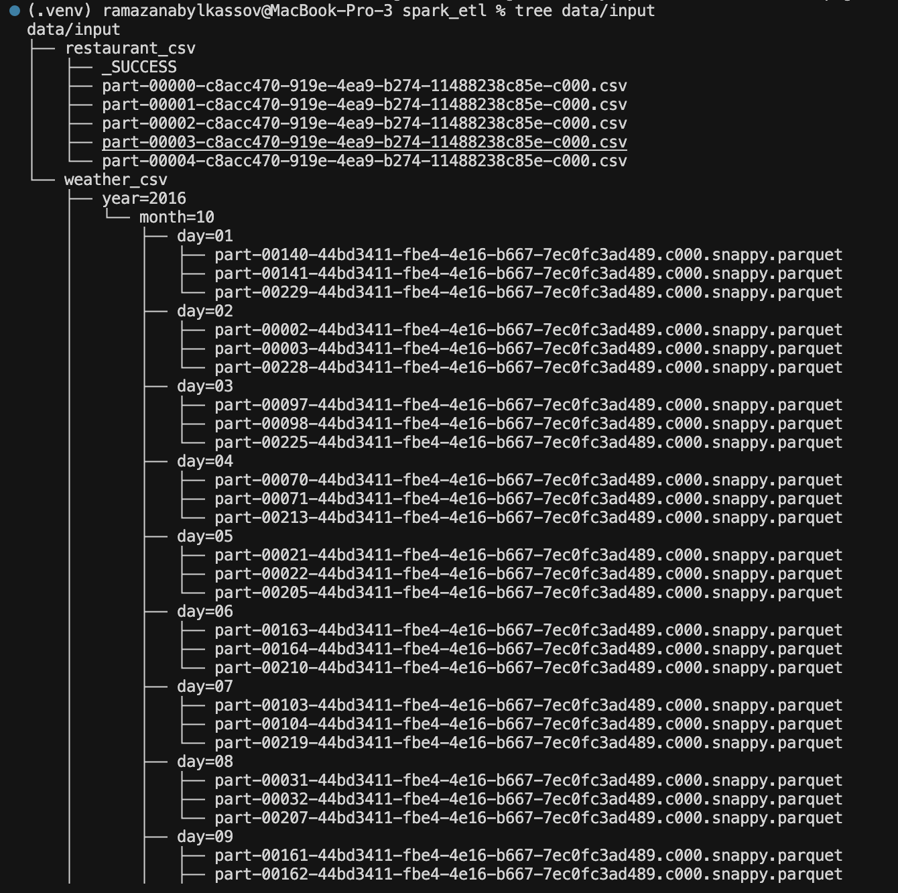
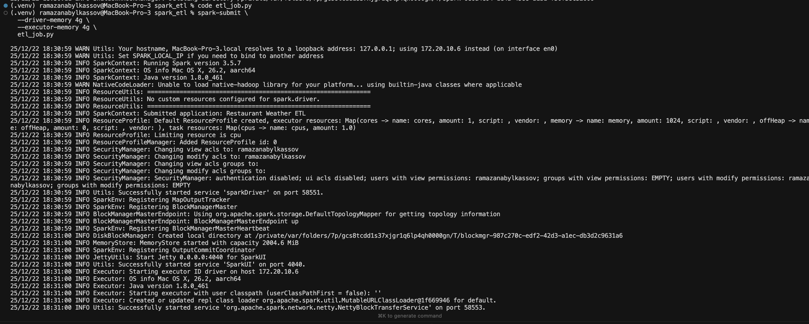
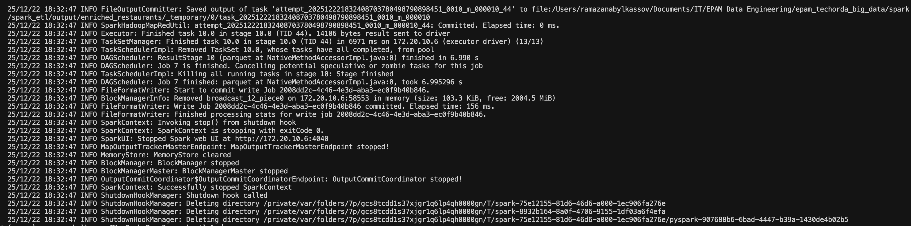

# Restaurant & Weather Spark ETL

> **Repository:** [epam_techorda_big_data/spark/spark_etl](https://github.com/ramazanabylkassov/epam_techorda_big_data/tree/main/spark/spark_etl)

## Overview

This project implements a local Apache Spark ETL job that enriches restaurant data with weather information based on geospatial proximity. The job is designed to run locally and follows best practices for data quality checks, deterministic joins, and idempotent output.

## Table of Contents

- [Input Data](#input-data)
- [Data Preparation Notes](#data-preparation-notes)
- [Data Quality Checks](#data-quality-checks)
- [Geohash Generation](#geohash-generation)
- [Join Strategy](#join-strategy)
- [Idempotency](#idempotency)
- [Output Data](#output-data)
- [Local Execution](#local-execution)
- [Testing](#testing)
- [Screenshots](#screenshots)

## Input Data

### Restaurant Data

| Property   | Value                          |
|------------|--------------------------------|
| Format     | CSV                            |
| Location   | `data/input/restaurant_csv/`   |
| Structure  | Multiple Spark-generated `part-*.csv` files |
| Coordinates| `lat` and `lng` columns        |

### Weather Data

| Property     | Value                        |
|--------------|------------------------------|
| Format       | Parquet                      |
| Location     | `data/input/weather_csv/`    |
| Partitioning | `year/month/day`             |
| Coordinates  | `lat` and `lng` columns      |

## Data Preparation Notes

The original weather dataset consisted of multiple independent Parquet directories (e.g., `weather`, `weather 2`, `weather 3`, etc.), each with its own partition root.

Apache Spark does not support reading multiple partition roots in a single operation. To ensure correct partition discovery and stable reads, the weather data was manually reorganized into a single Hive-style partitioned structure (`year/month/day`) under the `weather_csv/` directory.

This allows Spark to read the weather data as one logical dataset and automatically infer partition columns.

## Data Quality Checks

Restaurant records are validated for coordinate integrity:

```python
invalid_coords = restaurants.filter(
    F.col("lat").isNull() | F.col("lng").isNull()
)
print("Invalid coordinate rows:", invalid_coords.count())
```

Records with `lat` or `lng` equal to `NULL` are identified and the count is printed during execution.

## Geohash Generation

A four-character geohash is generated from latitude and longitude using the `geohash2` library via a custom PySpark UDF:

```python
@F.udf("string")
def geohash4(lat, lon):
    if lat is None or lon is None:
        return None
    return geohash2.encode(lat, lon, precision=4)
```

- The same `geohash4` UDF is applied to both restaurant and weather datasets
- Geohash precision is fixed at 4 characters
- The generated geohash is stored in a new column named `geohash`

## Join Strategy

To enrich restaurant data with weather information:

1. A four-character geohash is generated for both datasets
2. Weather data is deduplicated by geohash using `dropDuplicates(["geohash"])`
3. A left join is performed from restaurants to weather on the `geohash` column
4. Duplicate coordinate columns (`lat`, `lng`) from the weather dataset are dropped after the join

```python
weather_dedup = weather_geo.dropDuplicates(["geohash"])

enriched = (
    restaurants_geo
    .join(weather_dedup, on="geohash", how="left")
    .drop(weather_dedup["lat"])
    .drop(weather_dedup["lng"])
)
```

This approach guarantees:

- One output row per restaurant
- No row explosion
- Deterministic and repeatable results

## Idempotency

The ETL job is idempotent:

- Deterministic transformations are used throughout
- Weather data is deduplicated prior to joining
- Output is written using `mode("overwrite")`

Running the job multiple times with the same input data produces identical output.

## Output Data

| Property     | Value                          |
|--------------|--------------------------------|
| Format       | Parquet                        |
| Location     | `output/enriched_restaurants/` |
| Partitioning | `geohash`                      |

The output contains all restaurant fields enriched with weather attributes and is partitioned by geohash for efficient downstream access.

## Local Execution

The Spark session is configured to run locally using all available cores:

```python
spark = (
    SparkSession.builder
    .appName("Restaurant Weather ETL")
    .master("local[*]")
    .getOrCreate()
)
```

During execution, the job performs shuffle-intensive operations (deduplication, join, and partitioned write). To ensure stable execution on a local machine, allocate additional memory:

```bash
spark-submit --driver-memory 4g --executor-memory 4g etl_job.py
```

## Testing

Unit tests validate geohash generation and determinism. A lightweight Spark test is included to verify join cardinality logic.

**Note:** Due to a known PySpark 4.x JVM initialization issue under pytest, SparkSession-based tests are marked as expected failures (`xfail`). The join logic is fully validated through successful execution of the Spark ETL job using `spark-submit`.

## Screenshots

### Input Data Structure

The following screenshot shows the local input data structure used for the ETL job:

- Restaurant data stored as CSV files
- Weather data stored as partitioned Parquet files (`year/month/day`)



### Spark Job Execution

The Spark ETL job is executed locally using `spark-submit` with increased memory configuration to support shuffle-heavy operations.



### Successful Job Completion

The following screenshot shows the Spark job completing successfully with `exitCode 0`, confirming that all tasks finished and the output was committed.

